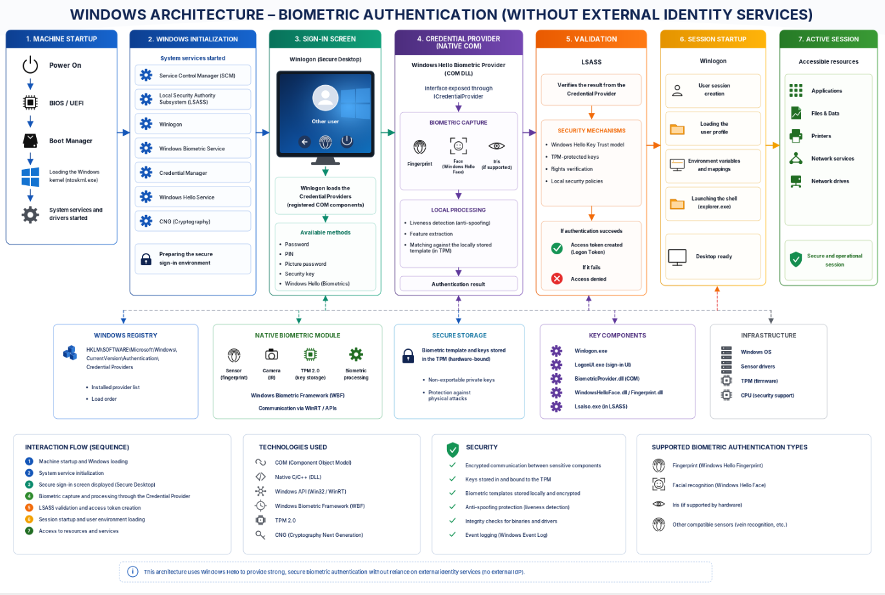
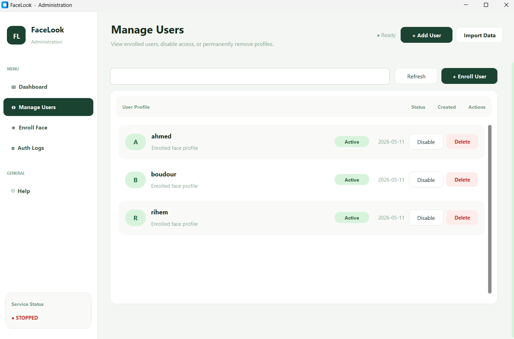
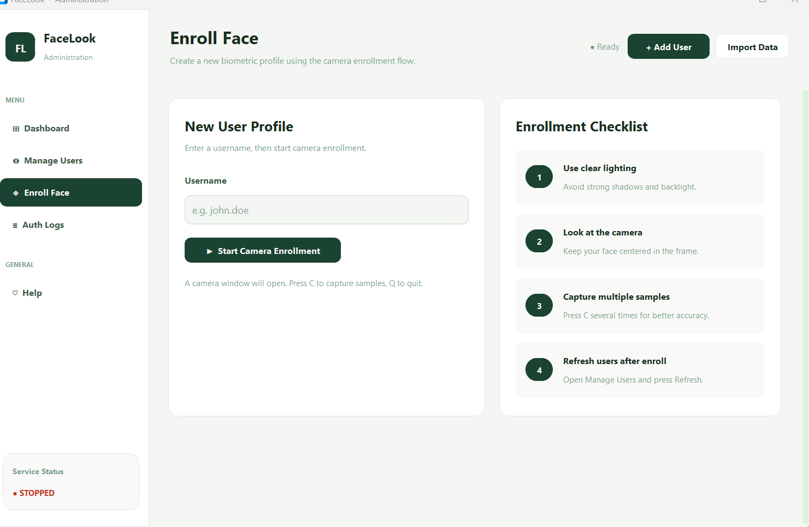
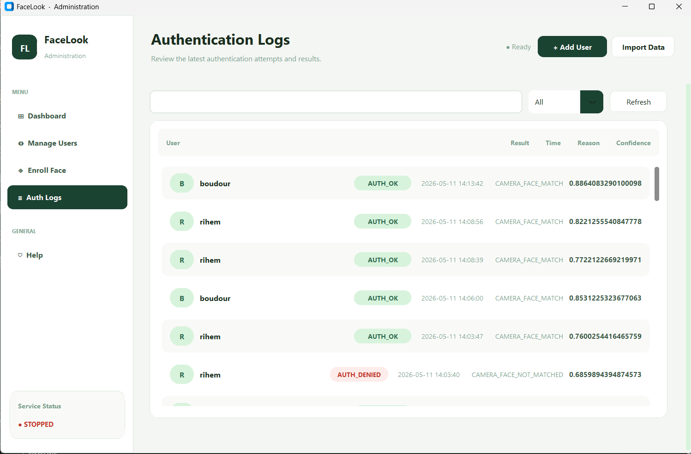

# FaceLook

FaceLook is a biometric authentication prototype that combines a Python-based face authentication service, a desktop administration UI, camera-based enrollment, and a Windows credential-provider prototype. The project is intended as a proof of concept for secure, local biometric identity workflows rather than a production-ready security product.


## Project overview

FaceLook provides:

- a lightweight authentication service over TCP or Unix sockets
- a desktop administration interface for user and log management
- camera-based enrollment and authentication flows
- encrypted storage of biometric embeddings in SQLite
- a Windows credential-provider integration prototype

## Repository structure

- `facelook-python/` - main Python implementation
  - `gui.py` - Tkinter/CustomTkinter administration dashboard
  - `facelook/` - core modules for config, database, encryption, embeddings, engines, protocol, and service
  - `tools/` - helper scripts for admin operations, enrollment, and test clients
  - `models/` - model assets used by the face pipeline
- `facelook-windows/` - Windows credential provider implementation prototype

## Features

### Authentication modes

The service supports three engine modes:

- `mock` - deterministic mock embedding-based authentication for quick testing
- `camera` - live camera-based face matching
- `liveness` - camera-based authentication with a motion-based liveness check

### Storage model

The database stores:

- encrypted biometric embeddings
- authentication logs
- user enrollment metadata

No raw face images are stored by the Python implementation.

## Requirements

- Python 3.10 or newer
- pip
- A webcam for camera-based enrollment/authentication

### Python dependencies

Install the required packages with:

```bash
cd facelook-python
pip install -r requirements.txt
```

The dependencies include:

- `numpy`
- `cryptography`
- `opencv-python`
- `customtkinter`
- `Pillow`

## Quick start

### 1. Create and activate a virtual environment

On Windows:

```powershell
cd facelook-python
python -m venv .venv
.venv\Scripts\Activate.ps1
```

On macOS/Linux:

```bash
cd facelook-python
python3 -m venv .venv
source .venv/bin/activate
```

### 2. Install dependencies

```bash
pip install -r requirements.txt
```

### 3. Start the authentication service

Run a mock engine for initial testing:

```bash
python -m facelook.service --transport tcp --host 127.0.0.1 --port 8765 --engine mock
```

Useful alternatives:

```bash
python -m facelook.service --engine camera
python -m facelook.service --engine liveness
```

The service listens for authentication requests and returns JSON responses.

### 4. Launch the administration UI

In a second terminal:

```bash
python gui.py
```

The GUI provides a dashboard for:

- viewing user statistics
- managing enrolled users
- enrolling new faces
- reviewing authentication logs
- checking service status



> If the Python modules are not available in the runtime environment, the UI can fall back to demo-mode stub data.

### Windows-specific notes

On Windows, the Python service is intended to run over TCP by default, which makes it easier to test from PowerShell and local development environments.

Example PowerShell setup:

```powershell
cd facelook-python
python -m venv .venv
.\.venv\Scripts\Activate.ps1
pip install -r requirements.txt

$env:FACELOOK_TRANSPORT = "tcp"
$env:FACELOOK_HOST = "127.0.0.1"
$env:FACELOOK_PORT = "8765"
```

If PowerShell blocks script execution for the virtual environment, run:

```powershell
Set-ExecutionPolicy -Scope Process -ExecutionPolicy Bypass
```

Then start the service with:

```powershell
python -m facelook.service --transport tcp --host 127.0.0.1 --port 8765 --engine mock
```

## Enrollment workflow

Enroll a user from the camera with:

```bash
python tools/enroll_camera.py alice --camera 0
```

The script will:

1. open the selected camera
2. detect a face in the frame
3. capture an embedding
4. store it encrypted in the local SQLite database

Press `E` to enroll once a face is detected, or `Q` to quit.

## Admin CLI

The repository includes a command-line admin helper for inspecting and managing biometric data.

List enrolled users:

```bash
python tools/admin.py users
```

Show authentication logs:

```bash
python tools/admin.py logs --limit 20
```

Show database statistics:

```bash
python tools/admin.py stats
```

Delete or disable a user profile:

```bash
python tools/admin.py delete alice
python tools/admin.py delete alice --permanent
```

## Test client

The test client can send ping and authentication requests to the service.

Ping the service:

```bash
python tools/client.py ping
```

Authenticate a known user:

```bash
python tools/client.py auth alice
```

## Configuration

The project uses environment variables and defaults defined in `facelook-python/facelook/config.py`.

Key variables include:

- `FACELOOK_HOME` - base storage directory (defaults to `~/.facelook`)
- `FACELOOK_TRANSPORT` - `tcp` or `unix`
- `FACELOOK_HOST` - host for TCP mode
- `FACELOOK_PORT` - port for TCP mode
- `FACELOOK_SOCKET_PATH` - Unix socket path
- `FACELOOK_DB_PATH` - SQLite database path
- `FACELOOK_KEY_PATH` - AES key storage path

Example:

```bash
set FACELOOK_TRANSPORT=tcp
set FACELOOK_HOST=127.0.0.1
set FACELOOK_PORT=8765
```

## Architecture notes

### Service layer

The service layer is implemented in `facelook-python/facelook/service.py`.
It:

- accepts incoming requests
- decodes the protocol payload
- dispatches authentication requests to the selected engine
- returns JSON-formatted responses

### Database layer

The database layer is implemented in `facelook-python/facelook/database.py`.
It stores:

- encrypted user embeddings
- authentication results
- timestamps and status flags

### Engine layer

The engine layer is implemented in `facelook-python/facelook/engine.py`.
It supports:

- deterministic mock matching
- real camera-based matching
- liveness-aware matching

## Security and production considerations

This project is a development prototype. Before using it in a production environment, consider:

- protecting the AES key with a hardware-backed key store or OS keyring
- restricting network access to the service
- reviewing the authentication thresholds and matching logic
- adding stronger identity-binding and anti-spoofing safeguards

## Windows credential provider prototype

The `facelook-windows/` directory contains a Windows credential-provider prototype for integrating FaceLook with the Windows login experience. This component is separate from the Python service and is not required to run the desktop UI or the local authentication workflow.

### What is included

The Windows prototype contains:

- `CredentialProvider/FacelookCredentialProvider.vcxproj` - Visual Studio project file
- `CredentialProvider/ClassFactory.*`, `FacelookCredential.*`, `FacelookProvider.*` - core credential-provider implementation files
- `CredentialProvider/FacelookServiceClient.*` - a client stub intended to talk to the Python service
- `CredentialProvider/FieldIds.h`, `Guid.*`, `SerializationHelpers.*` - helper code used by the provider layer

### Windows build prerequisites

To build the provider, use:

- Windows 10 or Windows 11
- Visual Studio 2022
- Desktop development with C++ workload
- Windows SDK
- x64 build tools

### Build steps

1. Open `facelook-windows/CredentialProvider/FacelookCredentialProvider.vcxproj` in Visual Studio.
2. Set the platform to `x64`.
3. Choose `Debug` or `Release`.
4. Build the solution.

The build output is expected to produce a credential-provider DLL for the Windows platform.

### Important runtime notes

This is a prototype, not a turnkey deployment. A credential provider is an OS-level component and typically requires:

- a properly configured Windows test machine or VM
- correct registration and installation steps for the provider DLL
- additional testing around logon UI behavior and security policies

Because Windows credential providers run at a very low level, they should be treated as experimental and validated carefully before being used in a real environment.

### Relationship to the Python service

The Python service and the Windows provider are intended to work together conceptually:

- the Python service handles biometric matching and storage
- the Windows provider acts as the front-end entry point for the Windows authentication experience

In practice, the provider code in this repository is a starting point for that integration and will need further hardening and testing before it can be considered production-ready.

## Troubleshooting

### Import errors

If you see missing-module errors:

```bash
pip install -r requirements.txt
```

### Camera errors

If camera enrollment or authentication fails:

- confirm that a camera is available
- try another camera index such as `--camera 1`
- ensure no other application is already using the camera

### Port binding issues

If the service cannot start:

- change the port with `--port`
- confirm the previous process is not still using the port

## License

No explicit license file is included in this repository. Treat the code as an internal or experimental prototype unless a separate license is provided.
